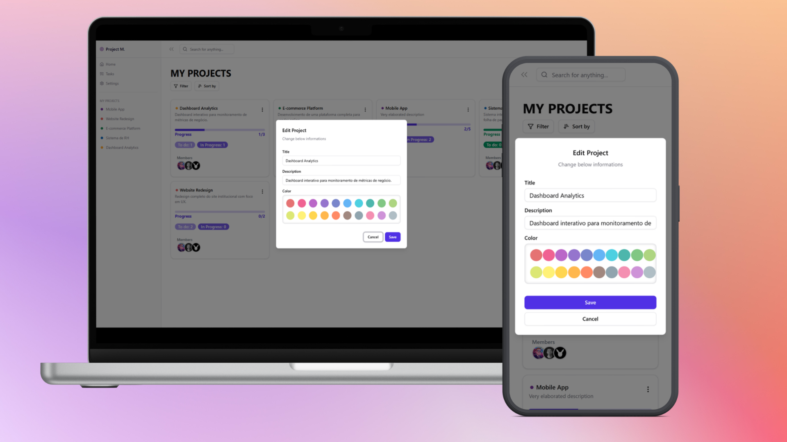
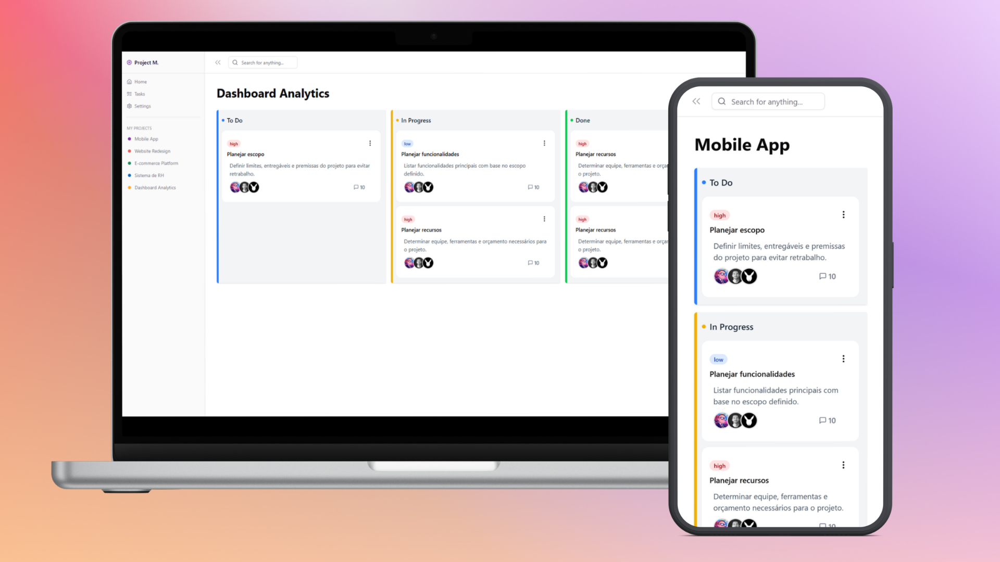

# 📋 Project Manager App

> ⚠️ **Status do Projeto:** Em Desenvolvimento (Work in Progress)
>
> Atualmente, o Frontend e o Backend operam de forma separada e **ainda não estão integrados**. O Frontend possui funcionalidades parciais e visuais em construção.

## 📖 Sobre o Projeto

O **Project Manager App** é uma aplicação para gerenciamento de projetos. O objetivo é permitir a criação, organização e acompanhamento de tarefas e quadros de projetos.

Este repositório contém tanto a API (Backend) quanto a Interface do Usuário (Frontend) em uma estrutura de monorepo simples.

## 📸 Demonstração Visual

Aqui estão algumas telas do projeto rodando localmente:

### Dashboard Principal


### Edição Básica de Projetos



### Tela de Tarefas



## 🛠 Tecnologias Utilizadas

### Backend

- **Node.js**
- **Express**
- **Sequelize** (ORM para banco de dados SQL)
- **MySQL** (ou o banco configurado no seu ambiente)
- **Jest/Supertest** (para testes de integração e unidade, conforme estrutura de pastas)

### Frontend

- **React**
- **Vite** (deduzido pela estrutura moderna)
- **Tailwind CSS** (estilização)
- **Context API / Hooks** (gerenciamento de estado)

---

## ⚙️ Pré-requisitos

Antes de começar, você precisará ter instalado em sua máquina:

- [Node.js](https://nodejs.org/en/) (versão 18 ou superior recomendada)
- [MySQL](https://www.mysql.com/) (ou o banco de dados de sua preferência configurado no Sequelize)
- Gerenciador de pacotes `npm` ou `yarn`.

---

## 🚀 Como Rodar o Projeto

Como a integração ainda não foi feita, é necessário rodar os serviços em terminais separados.

### 1️⃣ Configurando e Rodando o Backend

1.  Acesse a pasta do backend:

    ```bash
    cd "Project Manager App/Back"
    ```

2.  Instale as dependências:

    ```bash
    npm install
    ```

3.  Configure as variáveis de ambiente:
    - Crie um arquivo `.env` na raiz da pasta `Back` (baseado no `.env.example` se houver, ou nas configurações do `.sequelizerc`).
    - Defina as credenciais do banco de dados (`DB_USER`, `DB_PASS`, `DB_NAME`, etc.).

4.  Rode as migrações do banco de dados (Sequelize):

    ```bash
    npx sequelize-cli db:migrate
    ```

5.  Inicie o servidor:
    ```bash
    npm start
    # ou para modo de desenvolvimento com hot-reload:
    npm run dev
    ```
    _O servidor deve iniciar (geralmente na porta 3000 ou 3001)._

### 2️⃣ Configurando e Rodando o Frontend

1.  Abra um **novo terminal** e acesse a pasta do frontend:

    ```bash
    cd "Project Manager App/Front"
    ```

2.  Instale as dependências:

    ```bash
    npm install
    ```

3.  Inicie a aplicação React:

    ```bash
    npm run dev
    ```

4.  Acesse no seu navegador (geralmente em `http://localhost:5173` ou similar, verifique o terminal).

---

## 🚧 Roadmap & Pendências (To-Do)

Este projeto ainda não está finalizado. Abaixo estão as principais tarefas pendentes para a versão 1.0:

- **Integração:**
  - [ ] Conectar o Frontend aos endpoints da API do Backend (Fetch/Axios).
  - [ ] Tratar erros de API no Frontend.

- **Frontend:**
  - [ ] Finalizar componentes visuais (ajustes de CSS/Layout).
  - [ ] Implementar fluxo completo de criação de projetos.
  - [ ] Corrigir bugs de renderização/estado atuais.

- **Backend:**
  - [ ] Revisar validações de entrada.
  - [ ] Garantir cobertura de testes nas rotas principais.

---

## 🤝 Contribuição

Como o projeto é pessoal e está em estágio inicial, sugestões são bem-vindas. Sinta-se à vontade para abrir uma _issue_ se encontrar bugs críticos ao rodar o ambiente local.

---

Desenvolvido por **Fábio Penna**.
