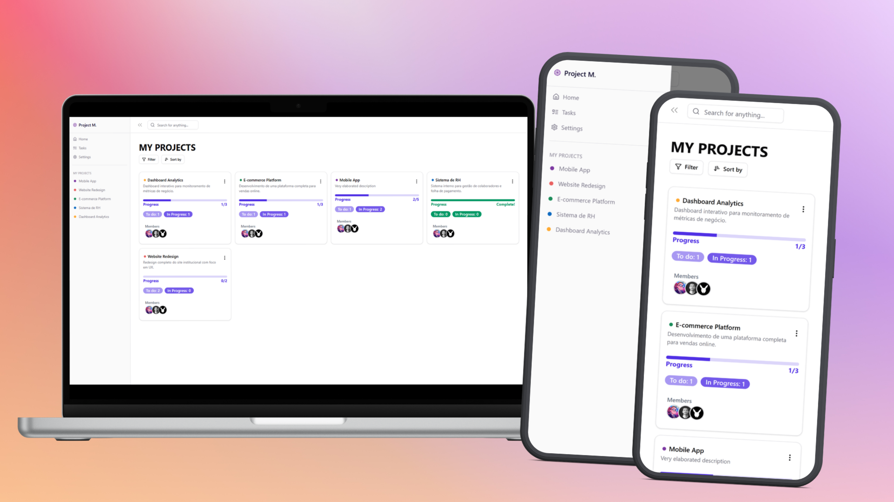

# 🎨 Project Manager UI (Frontend)

> **Status:** 🚧 Em Desenvolvimento (Visual/Mock)
>
> **Atenção:** O frontend ainda **não está integrado** com o backend. Atualmente ele utiliza dados mockados (fictícios) localizados em `src/mocks` para visualização das telas.

Interface do usuário para o gerenciador de projetos.

## 📸 Demonstração Visual

Aqui estão algumas telas do projeto rodando localmente:

### Dashboard Principal



### Edição Básica de Projetos


### Tela de Tarefas


## 🛠 Tecnologias

- **React** (Vite)
- **Tailwind CSS**
- **Context API / Hooks**
- **Mocks** (Dados estáticos para desenvolvimento)

## 📂 Estrutura Principal

```bash
Front/
├── src/
│   ├── components/
│   ├── helpers/
│   ├── hooks/
│   ├── mocks/
│   ├── pages/
│   ├── types/
│   └── utils/
├── App.tsx
├── index.css
├── main.tsx
...
```

## 🚀 Como Rodar

1.  **Instalação:**
    ```
    npm install
    ```
2.  **Iniciar Servidor de Desenvolvimento:**

    ```
    npm run dev
    ```

    _Acesse o link mostrado no terminal (ex: http://localhost:5173)_

## 📝 To-Do (Pendências)

- [ ] Integrar `services` com a API do Backend.
- [ ] Remover dados de `src/mocks` e usar dados reais.
- [ ] Finalizar funcionalidades.
- [ ] Ajustar responsividade.
